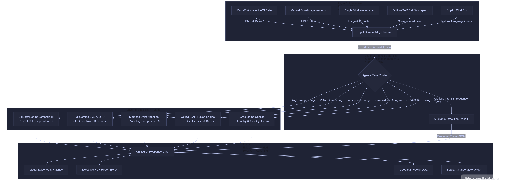

# 🛰️ SatQuery AI (Bhoomidristi) - Geospatial Copilot

An interactive, agentic vision-language assistant for multimodal remote-sensing image analysis through natural-language queries. Built for the Indian Space Research Organisation (ISRO) / Space Applications Centre (SAC) evaluation benchmarks and AI challenges.



---

## 🌟 Key Features & Novelty

Unlike traditional remote-sensing AI solutions that operate as isolated applications for a single predefined task, **SatQuery AI** introduces an **agentic, query-driven framework**. The system automatically interprets natural-language intents, validates input metadata/formats, dynamically sequences specialist remote-sensing models, and returns evidence-grounded responses paired with a transparent **Auditable Execution Trace**.

* **🤖 Agentic Orchestration & Tool Routing:** Automatically classifies user intent, validates input modalities, sequences tools, and emits an auditable execution trace.
* **👁️ Custom Fine-Tuned Vision-Language Model (VLM):** Adapted from **PaliGemma 2 (3B QLoRA)** for remote-sensing domain terminology, evaluated on **LR-RSVQA, HR-RSVQA, DOIR-RSVG, and VRSBench**.
* **🔄 Custom Siamese Change Detection CNN / UNet:** Custom-trained and evaluated on **LEVIR-CD** and **OSCD** datasets for robust bi-temporal structural change and deforestation tracking.
* **🌾 BigEarthNet-19 Semantic Triage:** Provides fast, confidence-calibrated land-cover scene classification from a single optical image using adapted ResNet-50 weights.
* **🌐 Cross-Modal Optical-SAR Reasoning:** Jointly analyzes co-registered optical (multispectral) and synthetic aperture radar (SAR) pairs (such as Cartosat-2S and RISAT data) using Lee speckle filtering and backscatter thresholds to detect changes under cloud cover or shadows.
* **🗺️ Native GeoTIFF & 16-bit Support:** Built-in `rasterio` and OpenCV pipelines ensuring seamless ingestion of geospatial imagery without metadata stripping or rendering errors.
* **📊 Compliance & Reporting:** Generates downloadable executive PDF reports (`FPDF`), GIS vector files (`.geojson`), and binary spatial change masks.

---

## 📁 Repository Structure

```text
project/
├── app.py                 # Main Flask application backend & endpoints
├── vlm_blueprint.py       # PaliGemma 2 VLM FastAPI/Flask blueprint
├── templates/
│   └── index.html         # Interactive frontend GUI dashboard
├── static/
│   └── style.css          # Styling & dark-mode theme
├── scripts/
│   ├── orchestrator.py    # Agentic workflow router & tracer
│   └── triage.py          # BigEarthNet-19 multi-label semantic triage
├── src/                   # Core neural network models & inference scripts
│   ├── model.py           # Siamese UNet Attention architecture
│   ├── inference.py       # Change detection inference logic
│   └── post_process.py    # Contour expansion & patch extraction
├── model/                 # Local model weights storage
└── uploads/ & saved_images/ # Temporary raster storage & caches

```

---

## 🛠️ Installation & Setup

### 1. Prerequisites

* Python 3.10+
* NVIDIA GPU with CUDA support (Recommended for PaliGemma 2 QLoRA and Siamese model inference)
* `GROQ_API_KEY` set in your environment variables for Copilot chat reasoning.

### 2. Clone and Install Dependencies

```bash
git clone [https://github.com/owner-username/satquery-ai.git](https://github.com/your-username/satquery-ai.git)
cd satquery-ai
pip install -r requirements.txt

```

### 3. Environment Variables

Create a `.env` file in the root directory:

```env
GROQ_API_KEY=your_groq_api_key_here
SATQUERY_ADAPTER=path_to_your_paligemma_lora_checkpoint

```

---

## 🚀 Running the Application

Start the Flask development server:

```bash
python app.py

```

Open your browser and navigate to:

```text
[http://127.0.0.1:5000](http://127.0.0.1:5000)

```

---

## 🔬 Representative Test Queries

You can interact with the system using natural language via the Copilot chat box or quick presets:

1. *"Describe the land-cover and major objects visible in this image."*
2. *"Highlight the water body referred to in the query."*
3. *"What changed between these two dates, and where did the change occur?"*
4. *"Use the optical and SAR images together to identify built-up and water-covered regions."*
5. *"Has the built-up area increased, decreased, or remained unchanged?"*

---

## 👥 Contributors

Developed by Amit Kumar Tiwari.

```

```
